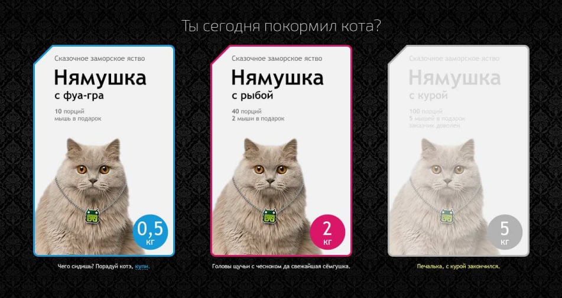

# Тестовое задание

Сверстайте страницу, показанную на рисунке. Внешний вид должен полностью
соответствовать макету, а поведение — описанию задачи.

1. Фон занимает всю площадь экрана, блок находится по центру вертикально и
   горизонтально.
2. На планшетах упаковки располагаются треугольником, на смартфонах друг под
   другом.
3. Информация о продукте может меняться.
4. Каждая из упаковок может быть выбрана или недоступна для выбора. Выбор
   осуществляется нажатием на упаковку или на текст «купи» в описании.
5. Можно выбрать одновременно несколько упаковок, а также отменить свой
   выбор повторным нажатием на упаковку.
6. Состояние наведения применяется к выбранной упаковке не сразу, а после того,
   как курсор ушел с нее после первоначального выбора.
